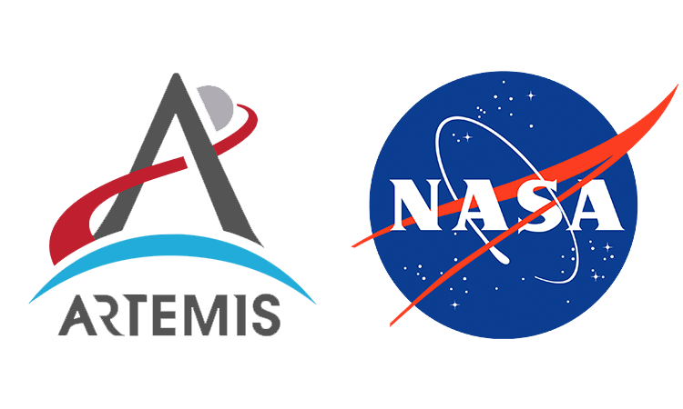

  
  <h1>NASA Simulation Exploration Experience 2021</h1>
  
"The Simulation Exploration Experience (SEE) joins students, industry, professional associations, and faculty together for an annual modeling and simulation (M&S) challenge. SEE champions collaborative collegiate-level modeling and simulation by providing a venue for students to work in highly dispersed inter-university teams to design, develop, test, and execute a simulated lunar mission. Participating teams gain valuable knowledge, skills, and increased employability by working closely with industry professionals, NASA, and faculty advisors."

<h1>Processo Seletivo</h1>

À fim de fazer parte da equipe, montei um <a href="https://github.com/luankleber/Portfolio-NASA2021/blob/main/NASA-190930-MECATRONICA.pdf">portfólio</a> que destaque minhas habilidades e facilidade de aprendizado. No mesmo encontra-se alguns dos meus trabalhos desenvolvidos nos primeiros meses de estudo da ferramente Blender. Além de minhas afeições ao tema abordado.

<h1>Conclusão</h1>

 Ao final do projeto, recebi um <a href="https://drive.google.com/file/d/1RegkxTVjcovMNAgwXz6IEyvm-qes99Yu/view">certificado</a>, além da confiança da equipe para continuar atuando nas próximas edições do projeto enquanto aluno da FACENS.
